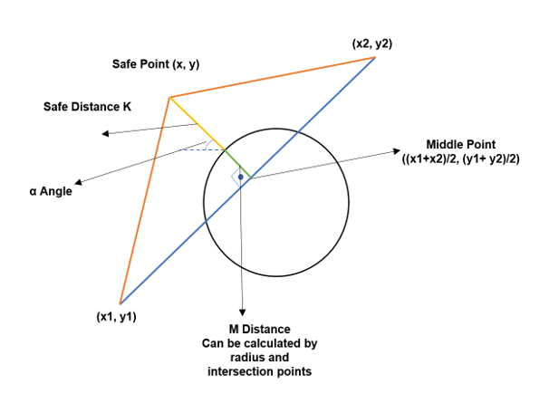
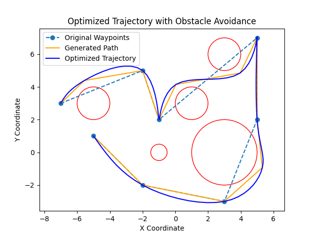

# Obstacle Avoidance and Trajectory Optimization

This repository contains an implementation of an **Obstacle Avoidance Algorithm** and a **Trajectory Optimizer**. The goal is to safely generate waypoints avoiding obstacles and produce a smooth trajectory for these waypoints, ensuring feasibility and continuity for robotic or dynamic systems.

---

## Obstacle Avoidance Algorithm

The **Obstacle Avoidance Algorithm** calculates safe waypoints to avoid obstacles on the path between two points. It ensures that a minimum safe distance is maintained from all obstacles and creates a new path that incorporates these safe points.

### Theory and Approach

The algorithm uses **geometric operations** to compute safe points when a path intersects an obstacle. The process is described in **Figure 1**.

<p align="center">
  
</p>
<p align="center"><b>Figure 1:</b> Obstacle Avoidance Process</p>

#### Steps:
1. **Intersection Detection**:
   - For each path segment, the algorithm checks if it intersects with any circular obstacle. The obstacle is defined as a center and radius $(x_c, y_c, r)$.

2. **Safe Point Calculation**:
   - If an intersection exists, the safe point is calculated based on:
     - **$K$**: User-defined safe distance.
     - **$M$**: Distance between the obstacle boundary and the middle point of the path.
     - **$\alpha$**: Angle between the obstacle center and the intersection point.
   - Safe point formula:

    $x = \frac{x_1 + x_2}{2} + [(K + M) \times \sin(\alpha)] \quad$ (1)

    $y = \frac{y_1 + y_2}{2} + [(K + M) \times \cos(\alpha)] \quad$ (2)

   - The safe point ensures the path avoids the obstacle while maintaining a smooth transition to adjacent waypoints.

3. **Iterative Updates**:
   - If multiple obstacles intersect a single path, the algorithm handles them sequentially, adding multiple safe points if required.

### Class Details

- **Inputs**:
  - `waypoints`: List of original waypoints $[(x_1, y_1), (x_2, y_2), \ldots]$.
  - `obstacles`: List of obstacles, each defined as $(x_c, y_c, r)$, where $x_c$, $y_c$ is the center and $r$ is the radius.
  - `safe_distance`: Minimum allowed distance from obstacles.
  - `safety_coefficient`: Multiplier to adjust the safety distance dynamically.

- **Outputs**:
  - A modified list of waypoints, including new safe points that avoid obstacles.

---

## Trajectory Optimizer

The **Trajectory Optimizer** generates a smooth and continuous trajectory based on the safe waypoints provided by the Obstacle Avoidance Algorithm. It ensures the trajectory is smooth and interpolates between waypoints according to the desired time resolution. **Figure 2** shows an example trajectory.

<p align="center">
  
</p>
<p align="center"><b>Figure 2:</b> Optimized Trajectory</p>

### Theory and Formulation

The trajectory optimization problem is formulated as a convex optimization problem. The objective is to minimize the second derivative of the trajectory (smoothness) while ensuring the trajectory passes through the provided waypoints. 

#### Objective:
Minimize the smoothness cost:

$ \min \sum_{i=2}^{n} \left( x[i] - 2x[i-1] + x[i-2] \right)^2 + \sum_{i=2}^{n} \left( y[i] - 2y[i-1] + y[i-2] \right)^2 $

#### Constraints:
1. The trajectory must pass through the given waypoints:

   $x[k] = x_{\text{waypoint}} \, y[k] = y_{\text{waypoint}}$
   
   for waypoint indices $k$.

2. The number of trajectory points is user-defined, ensuring flexibility for different applications.

### Class Details

- **Inputs**:
  - `waypoints`: List of safe waypoints $[(x_1, y_1), (x_2, y_2), \ldots]$.
  - `num_points`: Total number of points in the trajectory.
  - `time_step`: Discrete time period (1/frequency).

- **Outputs**:
  - **Positions**: Optimized $x(t)$ and $y(t)$ coordinates for all trajectory points.
  - **Time Array**: Corresponding time values for each point in the trajectory.

---

## Dependencies

- **cvxpy**: For optimization.
- **shapely**: For geometric calculations.
- **matplotlib**: For visualization.
- **numpy**: For numerical operations.

Install dependencies with:

```bash
pip install cvxpy shapely matplotlib numpy
```
